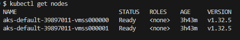
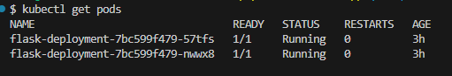
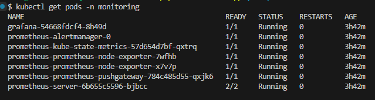
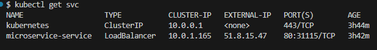
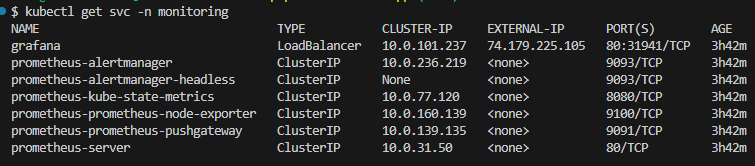
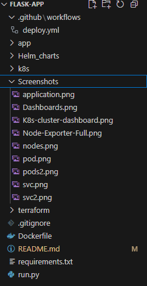

# 🚀 Microservices DevOps Project: Flask App on AKS

## All screenshots and links provided at the end of this file

This project demonstrates containerizing a Python Flask microservice, deploying it to an Azure Kubernetes Service (AKS) cluster provisioned via Terraform, automating CI/CD with GitHub Actions, and monitoring it using Prometheus and Grafana.
---
## 📋 Project Objectives

 **Dockerize** the Flask app (`run.py`)  
 **Provision** an AKS cluster using Terraform  
 **Deploy** the microservice via Kubernetes manifests  
 **Expose** the service externally using a LoadBalancer  
 **Automate CI/CD** using GitHub Actions  
 **Monitor** the app and cluster via Prometheus & Grafana
---
## 🐍 Application Overview

A simple Flask-based microservice that listens on port **5000**, with an endpoint defined in `run.py`.
---
## 🐳 Dockerization

Multi-stage Dockerfile to ensure a clean and minimal image:

```dockerfile
FROM python:3.9-slim AS builder
WORKDIR /app
COPY requirements.txt .
RUN pip install --user --no-cache-dir -r requirements.txt
FROM python:3.9-slim
WORKDIR /app
COPY . .
COPY --from=builder /root/.local /root/.local
ENV PATH=/root/.local/bin:$PATH
EXPOSE 5000
CMD ["python", "run.py"]
---

✅ Docker image build, tagged and pushed to Docker Hub:
    docker build -t ${{ secrets.DOCKER_USERNAME }}/flask-app:latest .
    docker push ${{ secrets.DOCKER_USERNAME }}/flask-app:latest

Note
    we need to engage sort of dynamic tagging in the build and push process, it is set here as :latest for demo purposes
_______________________________________________________________________________________________________________

☁️ Kubernetes Cluster Provisioning
Managed via Terraform in the terraform/ directory:

terraform init
terraform plan
terraform apply -auto-approve

This creates an AKS cluster (resource group, AKS-cluster) on Azure.
_______________________________________________________________________________________________________________

🚀 Application Deployment

Kubernetes manifests are in k8s/:
    deployment.yaml – 2 replicas, container port 5000
    service.yaml – LoadBalancer on port 80 → 5000
    namespace.yaml - the monitoring namespace
Deploy with:
    kubectl apply -f k8s/
_______________________________________________________________________________________________________________

🌍 External Access

$ kubectl get svc microservice-service
NAME                   TYPE           CLUSTER-IP   EXTERNAL-IP   PORT(S)        AGE
microservice-service   LoadBalancer   10.0.1.165   51.8.15.47    80:31115/TCP   130m

✅ App URL: http://51.8.15.47/
_______________________________________________________________________________________________________________

🔁 CI/CD with GitHub Actions

Workflow located at .github/workflows/deploy.yml automates:
    - Cloning the repo
    - Docker build & dockerhub push (remonadly/flask-app:latest)
    - Terraform provisioning (in case deploying infrastructure from scratsh, DR situation for example)
    - AKS deployment using azure/k8s-deploy
    - Helm install of Prometheus and Grafana (in case deploying infrastructure from scratsh, DR situation for example)

NOTE: 
    All the hashed lines in the workflow code should be enabled and used only when deploying everything from scratsh including the infrastructure and monitoring stack. And should be hashed when updating only the application deployed on AKS.

    A ServicePrincipal was created, assumed a contributor role and its json was placed as a secret in Github actions for the authentication/Integration between GitHub actions and Azure.

    A Docker Access Token should provided for the authentication/Integration between GitHub actions and Docker hub.
_______________________________________________________________________________________________________________

📊 Monitoring Stack

    Monitoring stack was deployed in "monitoring" name space
    Deployed Prometheus Helm charts internally.
    Modified and deployed Grafana Helm charts to be exposed by a Loadbalancer service for external access.

Note:
    Both charts can be modified as needed from the values.yaml file

Prometheus
    Prometheus added as data source in grafana with below URL:
        http://prometheus-server.monitoring.svc.cluster.local

Grafana Exposed via LoadBalancer

    $ kubectl get svc -n monitoring
    NAME                                  TYPE           CLUSTER-IP     EXTERNAL-IP      PORT(S)        AGE 
    grafana                               LoadBalancer   10.0.101.237   74.179.225.105   80:31941/TCP   139m

✅ Grafana URL: http://74.179.225.105:80

To get grafana admin password: 
    kubectl get secret --namespace monitoring grafana -o jsonpath="{.data.admin-password}" | base64 --decode ; echo

✅ Grafana Login:
    user:admin 
    Password: oaIsOKNUYR39Fmvgp8yXhdQbtutNtUJM733MWcAY

Note: 
    Two standard dashboards, predefined by Grafana Labs, were imported and used in our Grafana instance to monitor our solution. However, dashboards can be created and customized locally according to business needs and must be deployed in an IAC manner using the K8s CRDs, CRs, and K8s operator.

    Imported dashboards IDs:
        ID: 315   "Kubernetes cluster monitoring (via Prometheus)"
        ID: 1860  "Node Exporter Full"
    
            

    Kubernetes cluster monitoring Dashboard:

                

    Node Exporter Full dashboard
            
             

link to get any predefined standard Grafana dashboards : https://grafana.com/grafana/dashboards/
_______________________________________________________________________________________________________________

📂 Project Structure
.
├── .github/workflows/deploy.yml
├── app/
│   ├── routes
│   ├── services
│   └── main.py
│   └── _init_.py
├── k8s/
│   ├── deployment.yaml
│   ├── service.yaml
│   └── namespace.yaml
├── terraform/
│   ├── main.tf
│   ├── variables.tf
│   └── outputs.tf
│   └── provider.tf
├── Helm_charts/
│   ├── prometheus/
│   └── grafana/
├── run.py
├── requirements.txt
├── Dockerfile
└── README.md

_______________________________________________________________________________________________________________

Screenshots & links:

    - The Github repo link: https://github.com/remonadly/flask-app
    - App URL: http://51.8.15.47/users
    - Grafana URL: http://74.179.225.105:80
    - Grafana Login:
        user:admin 
        Password: oaIsOKNUYR39Fmvgp8yXhdQbtutNtUJM733MWcAY
    











